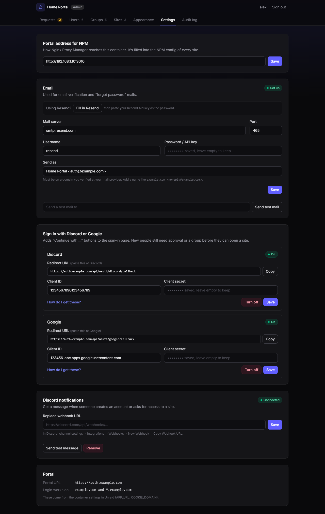
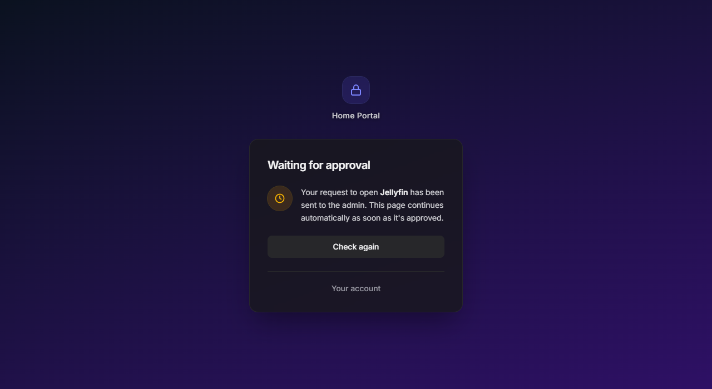
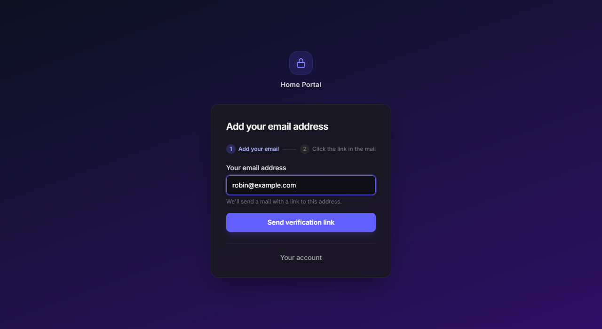
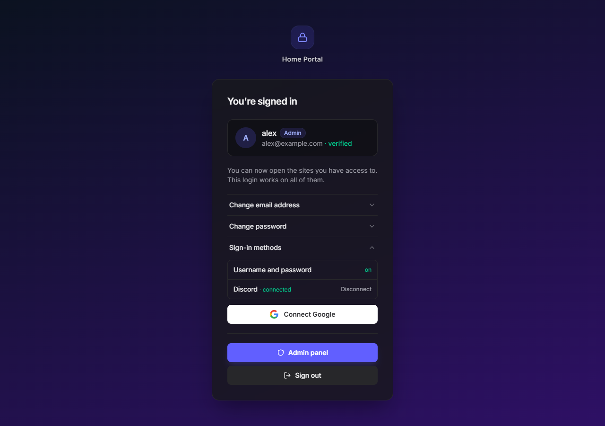
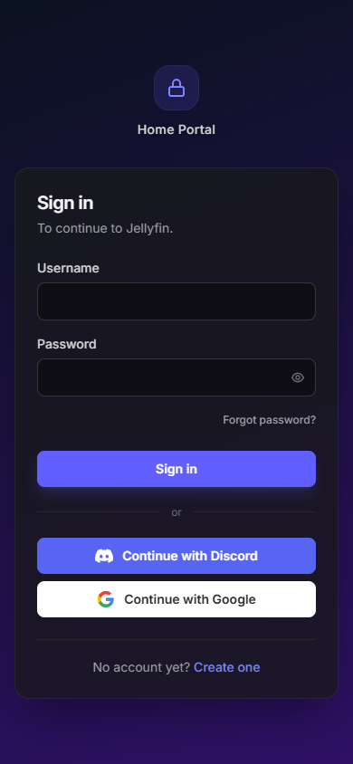

# turkushan-auth

A self-hosted login portal for your subdomains behind **Nginx Proxy Manager** (forward auth, like Tinyauth).
People create their own account, you decide per site who gets in, and one login works on all your subdomains.

Everything runs in **one container**: a Go backend and a Svelte frontend in a single binary, with SQLite in `/data`. No database server, no Redis, no compose.


## Features

- **Sign in, create account, forgot password**: dark, mobile-friendly pages
- **Continue with Discord or Google** (optional)
- **Unlock sites by Discord server or role:** everyone with a certain role in your Discord server gets into the sites you choose, automatically, without a bot
- **Single sign-on** across `*.your-domain` with one session cookie
- **Per site:** "needs approval" or "open for everyone signed in", and optionally "needs a verified email"
- **Back to where you were:** after signing in, visitors land on the page they opened
- **Admin panel:**
  - approve/deny requests
  - manage users (create or invite, access per site, block, unlock, reset password, delete), with search, filters and sorting
  - groups that give site access and panel rights, with auto-add rules; several admins
  - add sites with a ready-to-paste NPM config and a **Copy** button
  - audit log of every admin action
- **Your own look:** logo, site name, accent color, font and background (image, color or gradient), set in the admin panel with a live preview
- **Email** via any SMTP provider (Resend recommended): verify addresses, reset passwords
- **Discord notifications** for new accounts and access requests
- **Security:** argon2id, server-side sessions, CSRF protection, rate limits, lockout, open-redirect protection, strict security headers; see [SECURITY.md](SECURITY.md)

## Screenshots

| | |
|---|---|
|  **Users:** who can open what, groups, login methods, search and filters |  **Groups:** site access, panel rights and auto-add rules |
|  **Requests:** approve or deny |  **Sites:** rules per site and the NPM config to paste |
|  **Appearance:** logo, colors, font, background |  **Settings:** email, Discord/Google login, notifications |
|  **Waiting for approval** |  **First sign-in with Discord or Google** |
|  **Verified email needed** |  **Account page** |



## Example: unlock sites with a Discord role

Give everyone with a certain role in your Discord server access to a site, without approving them one by one:

1. Turn on Discord login in **Settings → Sign in with Discord or Google** ([how](docs/GUIDE.md#81-discord)).
2. **Groups → New group**, e.g. "Discord VIP". Under **Sites**, tick **Can open** for the sites the role unlocks.
3. Under **Auto-add rules**, choose **Discord role** and paste your server ID and role ID (Discord → Settings → Advanced → Developer Mode, then right-click the server or role → Copy ID).

From then on, everyone with that role gets in right after signing in with Discord. Take the role away and they're out at their next Discord sign-in. Roles are read when someone signs in, so no bot is needed. Details: [guide, step 8.4](docs/GUIDE.md#84-auto-add-rules-for-discord-and-google).

## Get started

**[📖 Read the guide](docs/GUIDE.md)**. It covers installing on Unraid, the NPM setup, protecting your first site, email with Resend, Discord, backups and troubleshooting.

Quick version:

1. Install `turkushan-auth` from **Community Apps**, or via the template in [`templates/`](templates/turkushan-auth.xml). Set `APP_URL`, `ADMIN_USER` and `ADMIN_PASSWORD`.
2. In NPM, add a proxy host `auth.your-domain` → `<server-ip>:3010` with SSL, and **Block Common Exploits off**.
3. Sign in at `https://auth.your-domain` → **Admin panel → Sites → Add site**.
4. Copy the site's **NPM config** into the Advanced tab of that site's proxy host in NPM.

## Settings

| Variable | Default | |
|---|---|---|
| `APP_URL` | **required** | public portal URL, e.g. `https://auth.example.com` |
| `ADMIN_USER` / `ADMIN_PASSWORD` | | admin created on first start; the password is not overwritten on restart |
| `COOKIE_DOMAIN` | derived from `APP_URL` | `auth.example.com` gives `.example.com`, shared by all subdomains |
| `TRUSTED_PROXIES` | `172.16.0.0/12` | proxy addresses allowed to pass client IP headers |
| `PORTAL_INTERNAL_URL` | | how NPM reaches the portal; can also be set in the admin panel |
| `SESSION_SECRET` | auto-generated in `/data/secret` | |
| `PUID` / `PGID` | `99` / `100` | user the app runs as |
| `PORT` | `3010` | port inside the container |

Email, Discord and the portal address are set in **Admin panel → Settings**.

## Recovery

Locked out of the admin account without a verified email?

```bash
docker exec turkushan-auth /turkushan-auth reset-password <username> '<new password>'
```

## Development

GitHub Actions (`.github/workflows/build.yml`) builds the frontend, runs `go vet`, `go test` and `govulncheck`, then pushes `ghcr.io/turkushan490/turkushan-auth:latest` on every push to `main`. A `v1.2.3` tag also pushes `:1.2.3`.

```bash
cd web && npm install && npm run build && cd ..
APP_URL=http://localhost:3010 DATA_DIR=./data ADMIN_USER=admin ADMIN_PASSWORD='Change!me' go run ./cmd/turkushan-auth
```

For frontend work, `npm run dev` in `web/` proxies `/api` to a portal running on port 3010.

## License

MIT
