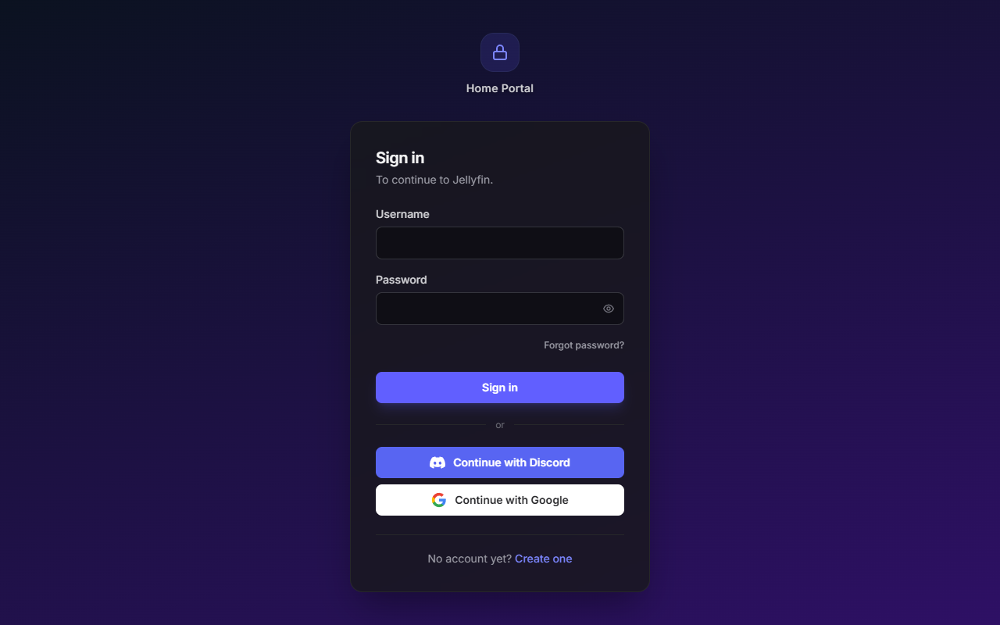
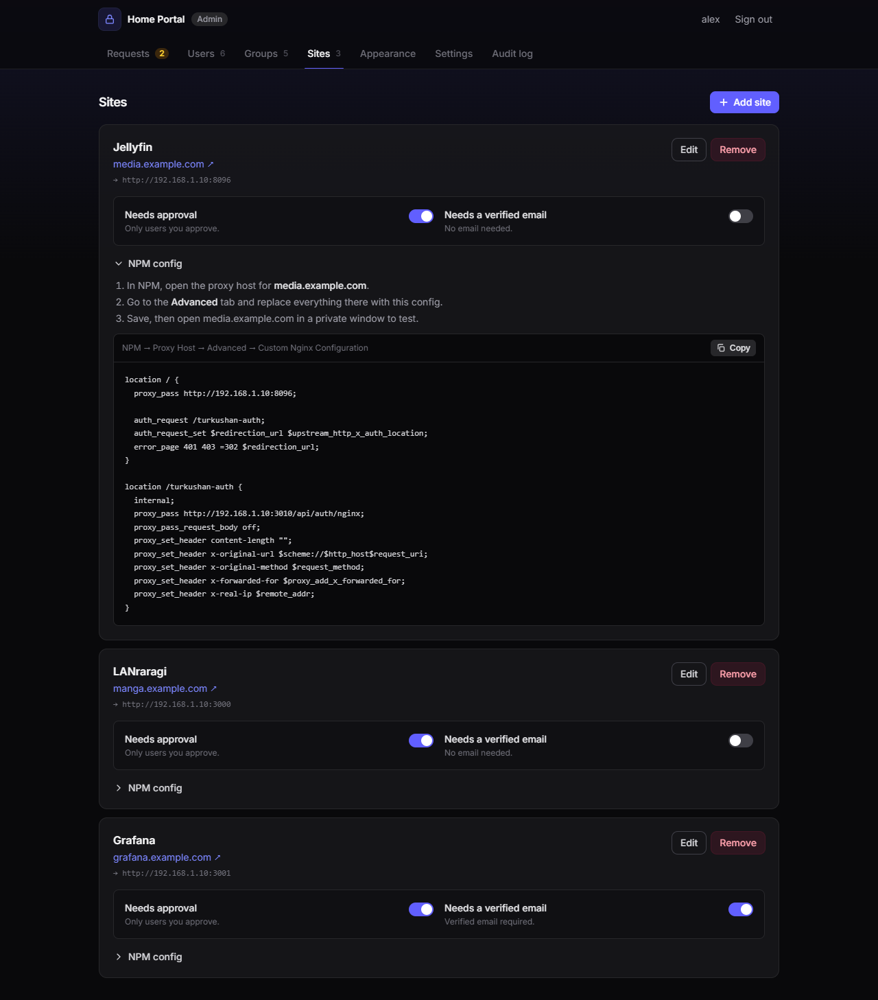
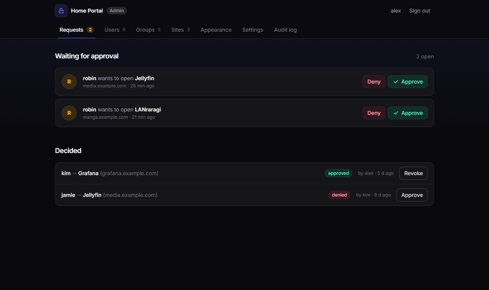
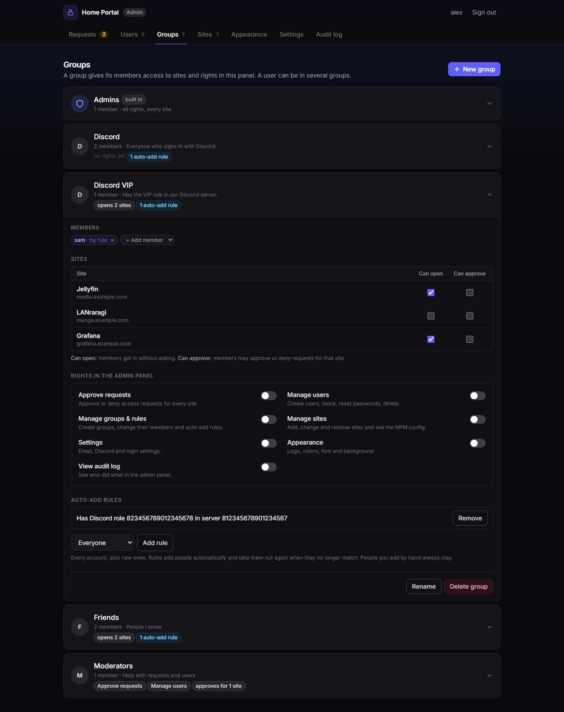
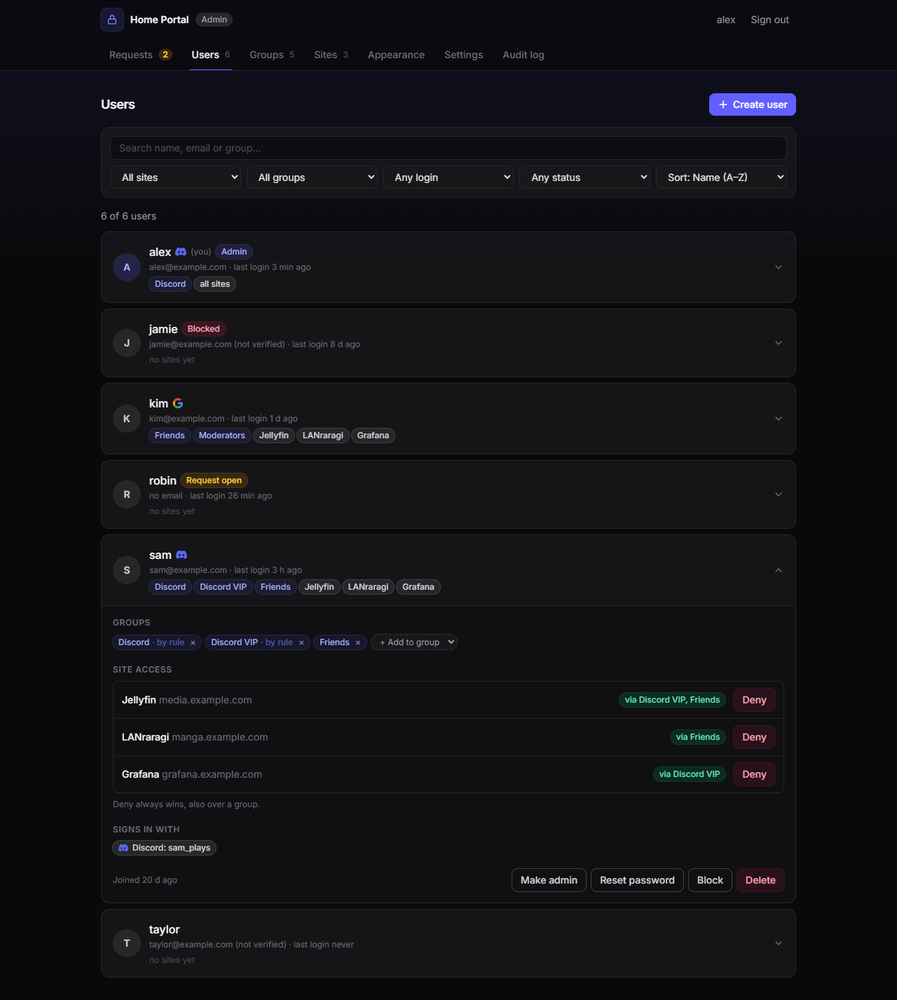
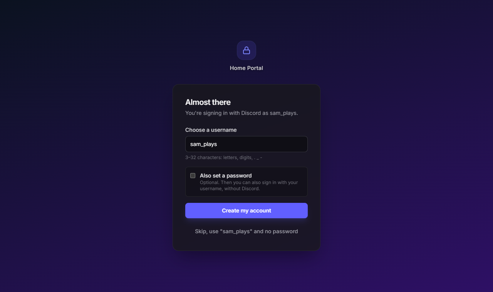
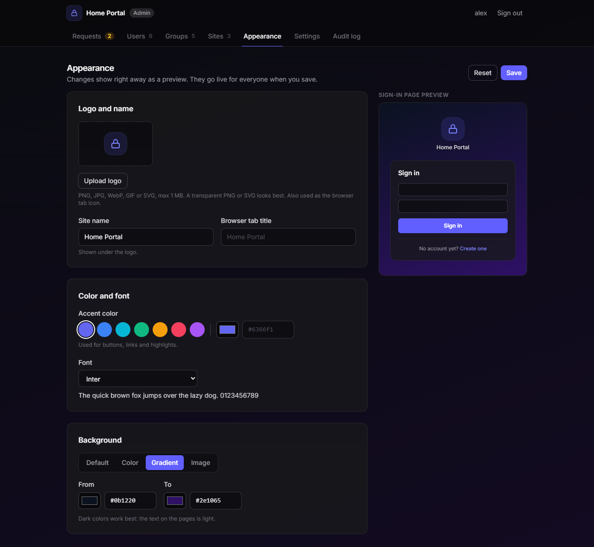

# turkushan-auth guide

Step by step: install the portal on Unraid, put it behind Nginx Proxy Manager, protect your first site, and set up email and Discord notifications.

The examples use `example.com`. Replace it with your own domain.

- [How it works](#how-it-works)
- [1. Install on Unraid](#1-install-on-unraid)
- [2. Put the portal behind Nginx Proxy Manager](#2-put-the-portal-behind-nginx-proxy-manager)
- [3. First sign-in](#3-first-sign-in)
- [4. Protect a site](#4-protect-a-site)
- [5. Approving users](#5-approving-users)
- [6. Groups, rights and more admins](#6-groups-rights-and-more-admins)
- [7. Email (verification and password reset)](#7-email-verification-and-password-reset)
- [8. Sign in with Discord or Google](#8-sign-in-with-discord-or-google)
- [9. Discord notifications](#9-discord-notifications)
- [10. Make it yours: logo, colors and background](#10-make-it-yours-logo-colors-and-background)
- [11. Updates, backups and recovery](#11-updates-backups-and-recovery)
- [Troubleshooting](#troubleshooting)

---

## How it works

```
visitor ──► NPM (manga.example.com) ──► "may this person in?" ──► turkushan-auth :3010
                    │                                                   │
                    │   200 yes ─► forwards to the app (e.g. LANraragi)  │
                    └── 401/403 no ─► redirect to auth.example.com ◄────┘
                                        (sign in / create account / waiting for approval)
```

- The portal runs at `https://auth.example.com`.
- Every protected site keeps its own NPM proxy host, with a small block in its **Advanced** tab. NPM asks the portal on every request whether the visitor may in (nginx `auth_request`).
- One login works on all subdomains, because the session cookie is set on `.example.com`.
- After signing in, visitors go straight back to the page they opened.

It works the same way as Tinyauth, so if you use Tinyauth now, switching a site is a matter of replacing its Advanced block.

---

## 1. Install on Unraid

**Via Community Apps:** in the **Apps** tab, search for `turkushan-auth` and click **Install**.

**Or manually:** open the Unraid terminal (`>_` top right) and run:

```bash
wget -O /boot/config/plugins/dockerMan/templates-user/my-turkushan-auth.xml \
  https://raw.githubusercontent.com/turkushan490/turkushan-auth/main/templates/turkushan-auth.xml
```

Then go to **Docker → Add Container** and pick `turkushan-auth` under **Template**.

Fill in:

| Setting | Example | Notes |
|---|---|---|
| **APP_URL** | `https://auth.example.com` | The public address of the portal. Required. |
| **ADMIN_USER** | `turkushan` | Your admin account, created on first start. |
| **ADMIN_PASSWORD** | `…` | At least 6 characters, 1 capital letter, 1 symbol. Only used to create the account; you can remove it from the settings after the first start. |
| Web port | `3010` | Change it if 3010 is already in use. |
| Data | `/mnt/user/appdata/turkushan-auth` | Database and generated secret. |

Advanced settings (the defaults are fine for most setups):

| Setting | Default | Notes |
|---|---|---|
| COOKIE_DOMAIN | derived from APP_URL | `auth.example.com` gives `.example.com`. |
| TRUSTED_PROXIES | `172.16.0.0/12` | NPM's address as seen by the portal. The default covers Docker networks. |
| PORTAL_INTERNAL_URL | empty | Easier to set in the admin panel (Settings → Portal address). |
| PUID / PGID | `99` / `100` | Unraid's `nobody:users`. |

Click **Apply**, then open `http://<server-ip>:3010/healthz`. It should say `ok`.

---

## 2. Put the portal behind Nginx Proxy Manager

In NPM, add a **Proxy Host**:

| Field | Value |
|---|---|
| Domain Names | `auth.example.com` |
| Scheme | `http` |
| Forward Hostname / IP | your server IP, e.g. `192.168.0.6` |
| Forward Port | `3010` |
| Block Common Exploits | **off** (login links carry URLs in the query string, which this option blocks) |
| SSL tab | request a Let's Encrypt certificate, turn on **Force SSL** and **HTTP/2** |

Make sure `auth.example.com` points to your public IP in DNS, like your other subdomains.

> Signing in only works on `https://auth.example.com`, not on `http://<server-ip>:3010`: the login cookie belongs to your domain. The portal shows a warning if you open it on the wrong address.

---

## 3. First sign-in



Open `https://auth.example.com` and sign in with `ADMIN_USER` / `ADMIN_PASSWORD`. You'll see **You're signed in** with an **Admin** badge, and an **Admin panel** button.

In **Admin panel → Settings**, set **Portal address for NPM** to how NPM reaches the container, e.g. `http://192.168.0.6:3010`. It's filled into every NPM config the panel generates.

The admin panel has seven tabs:

| Tab | What you do there |
|---|---|
| **Requests** | Approve or deny who may open which site. |
| **Users** | Create users; per user: groups, access per site, block/unblock, unlock, reset password, make admin, delete. Search, filter and sort. |
| **Groups** | Groups with site access and panel rights, auto-add rules, and the built-in Admins group. |
| **Sites** | Add sites, choose the rules, copy the NPM config. |
| **Appearance** | Logo, site name, colors, font and background. |
| **Settings** | Portal address, email, sign in with Discord/Google, Discord notifications. |
| **Audit log** | Every admin action with time, admin and IP. |

---

## 4. Protect a site

Example: LANraragi at `manga.example.com`, running on `192.168.0.6:3000`.

**In the portal:** Admin panel → **Sites** → **Add site**

| Field | Example | Notes |
|---|---|---|
| Name | `LANraragi` | Shown to users and in Discord messages. |
| Hostname | `manga.example.com` | Must be under your cookie domain. |
| Where the app runs | `http://192.168.0.6:3000` | The app's own IP and port, the same as the Forward Hostname/Port in NPM. **Not** the public URL and **not** the portal's port. |
| Needs approval | on | Off = everyone who is signed in can open it. |
| Needs a verified email | off | On = only users with a verified email address. Needs email to be set up (step 7). |

Click **Add site**, open **NPM config** on the site and click **Copy**.



**In NPM:** open the proxy host for `manga.example.com` (create it as usual if it doesn't exist yet) → **Advanced** tab → replace everything in *Custom Nginx Configuration* with the copied config → **Save**.

The config looks like this:

```nginx
location / {
  proxy_pass http://192.168.0.6:3000;

  auth_request /turkushan-auth;
  auth_request_set $redirection_url $upstream_http_x_auth_location;
  error_page 401 403 =302 $redirection_url;
}

location /turkushan-auth {
  internal;
  proxy_pass http://192.168.0.6:3010/api/auth/nginx;
  proxy_pass_request_body off;
  proxy_set_header content-length "";
  proxy_set_header x-original-url $scheme://$http_host$request_uri;
  proxy_set_header x-original-method $request_method;
  proxy_set_header x-forwarded-for $proxy_add_x_forwarded_for;
  proxy_set_header x-real-ip $remote_addr;
}
```

**Test** in a private/incognito window: open `https://manga.example.com` → you land on the sign-in page → sign in → you're sent back to the site (or to "Waiting for approval" for a new user).

> **Coming from Tinyauth?** Only the Advanced block changes. Keep a copy of your old Tinyauth block; pasting it back undoes the switch.

Sites that are **not** in the Sites list are denied for everyone. That way a forgotten entry can't accidentally open a site.

---

## 5. Approving users

1. Someone creates an account at `auth.example.com` and opens a site that needs approval.
2. They see **Waiting for approval**. You see the request in **Admin panel → Requests** (and get a Discord message, see step 9).
3. Click **Approve**. They can open the site right away (**Check again** on their page, or just reload the site).



You can also give access up front: **Users** → click the user → **Give access** next to the site. Revoking works the same way, and takes effect on their next page load.

Admins can always open every registered site.

---

## 6. Groups, rights and more admins

### Groups

A group gives its members **access to sites** and, if you want, **rights in the admin panel**. A user can be in several groups and gets everything their groups give, added together.

Admin panel → **Groups** → **New group**, then open the group:



| Section | What you set |
|---|---|
| **Members** | Add or remove people. "by rule" means an auto-add rule put them there. |
| **Sites** | Per site: **Can open** (members get in without asking) and **Can approve** (members may approve or deny requests for that site, a moderator for just that site). |
| **Rights in the admin panel** | Approve requests (all sites) · Manage users · Manage groups & rules · Manage sites · Settings · Appearance · View audit log. |
| **Auto-add rules** | Who is put in the group automatically: **Everyone**, a specific **email address**, everyone on an **email domain** (verified addresses only), or by **login method**, **Discord server** or **Discord role** (see step 8). |

How it works:

- People with rights but without full admin only see the tabs they have rights for.
- Only admins can change what a group may do (its site rights and panel rights).
- Nobody can hand out more than they have: someone with "Manage groups" can't change or join a group that has rights they lack.
- An explicit **Deny** for a user on a site always wins, also over a group.
- Rules keep themselves up to date: people are added when they match and taken out when they no longer do. People you add by hand always stay.

Example: a group **Friends** with *Can open* on LANraragi and a rule "Email domain: example.com". Everyone who verifies an `@example.com` address can open LANraragi right away.

### Admins

**Admins** is the built-in group with all rights. In **Groups → Admins** or on a user in **Users**, an admin can make someone else admin or take it away. You can't remove your own admin rights; another admin has to do that, so there's always at least one.

### Creating users yourself

**Users → Create user**:

- **I set the password:** you type a password and tell them. They can change it on their account page.
- **Send invite mail:** they get a mail with a link to choose their own password (needs email to be set up, see the next step). Using the link also verifies their address.



Pick their groups right away. The Users tab can be searched by name, email or group, filtered by site (who can open it), group and status, and sorted by name, newest or last login.

---

## 7. Email (verification and password reset)

With email set up, users can:

- verify their email address (needed for sites with **Needs a verified email**)
- reset their own password with **Forgot password?**

Without email everything else still works; you reset passwords yourself in **Users → Reset password**.

The portal sends through any SMTP provider. **[Resend](https://resend.com)** is recommended: free up to 3,000 mails per month, EU servers, simple setup. Others work too (Brevo, Postmark, Mailgun, SendGrid, Amazon SES) with their SMTP settings.

### 7.1 Add your domain in Resend

1. Create an account at [resend.com](https://resend.com).
2. **Domains → Add Domain** → `example.com`, region **EU (Ireland)** (or the one closest to you).
3. Resend shows the DNS records to add. Keep that page open.

### 7.2 Add the DNS records at your domain provider

Open the DNS settings of your domain (for example at Versio: **Domeinen → your domain → DNS beheer**). Add each record **exactly** as Resend shows it. For a Resend account in the EU region, it looks like this:

| Type | Name | Value |
|---|---|---|
| TXT | `resend._domainkey` | `p=MIGfMA0…` (your own key from Resend) |
| CNAME | `send` | `send.forge.rmta.net` |
| CNAME | `rsend` | `rsend-euw1.forge.rmta.net` |
| TXT | `_dmarc` | `v=DMARC1; p=none;` (recommended) |

Important:

- **Use the values from your Resend page**, not the ones above; they can differ per account and region.
- If your provider shows `.example.com` after the name field, only type the first part (`send`, `resend._domainkey`, …).
- **Don't change your existing mail records**, such as the MX on `example.com` itself or its `v=spf1 …` TXT record. Resend only uses the `send`, `rsend` and `resend._domainkey` names, so your normal mailbox keeps working.
- A **CNAME can't share its name with other records**. If `send` already has an MX or TXT record (for example from an older Resend setup), delete those first.
- If you already have a `_dmarc` record, keep yours instead of adding a second one.

Back in Resend, click **Verify DNS Records**. It usually turns green within a few minutes. Changes can take up to an hour to be visible everywhere.

### 7.3 Create an API key

Resend → **API Keys → Create API Key**:

- Name: `turkushan-auth`
- Permission: **Sending access**
- Domain: `example.com`

Copy the key (starts with `re_`). You only see it once. Keep it secret.

### 7.4 Fill in the portal

Admin panel → **Settings → Email**:

1. Click **Fill in Resend** (mail server `smtp.resend.com`, port `465`, username `resend`).
2. **Password / API key:** paste your `re_…` key.
3. **Send as:** `example.com <auth@example.com>`.
4. **Save**, then **Send test mail** to your own address.

> **Tip for the inbox:** use a normal-looking sender such as `auth@` or `login@` instead of `noreply@`. Outlook/Hotmail put mails from `noreply@` on a brand-new domain in Junk more easily. The address doesn't need to be a real mailbox.

Also check in Resend → Domains → your domain → **Configuration** that **click tracking** and **open tracking** are off. Tracking rewrites the links in the mail, and spam filters distrust login mails with rewritten links.

### 7.5 Test

1. Your account page → **Add email address** → address + password → **Save** → click the link in the mail → **Email verified**.
2. Sign out → **Forgot password?** → your username → click the link in the mail → choose a new password → sign in with it.

---

## 8. Sign in with Discord or Google

Adds **Continue with Discord** and **Continue with Google** buttons to the sign-in page. Both are optional and free. Set them up in Admin panel → **Settings → Sign in with Discord or Google**. Each has a **Redirect URL** there with a Copy button; you need it below.

### 8.1 Discord

1. Go to [discord.com/developers/applications](https://discord.com/developers/applications) → **New Application** → give it a name (people see this name when they sign in).
2. Open **OAuth2** in the left menu. Under **Redirects**, click **Add Redirect** and paste the Redirect URL from the portal (`https://auth.example.com/api/oauth/discord/callback`). **Save Changes**.
3. Copy the **Client ID**. Click **Reset Secret** and copy the **Client Secret** (you only see it once).
4. In the portal, paste both under **Discord** and click **Save**.

### 8.2 Google

1. Go to [console.cloud.google.com](https://console.cloud.google.com) and create a project.
2. **APIs & Services → OAuth consent screen**: choose **External**, fill in an app name and your email address, save, and **publish** the app (otherwise only test users you add can sign in).
3. **APIs & Services → Credentials → Create credentials → OAuth client ID**, application type **Web application**.
4. Under **Authorized redirect URIs**, add the Redirect URL from the portal (`https://auth.example.com/api/oauth/google/callback`). **Create**.
5. Copy the **Client ID** and **Client secret**, paste them in the portal under **Google** and click **Save**.

### 8.3 How it works for users



- **First time:** after Discord/Google they see **Almost there**: choose a username and, if they want, a password. Or **Skip**: they get a suggested username and no password, and keep signing in with Discord/Google.
- **Already have an account?** If the verified email at Discord/Google is the same as the verified email on an account, they're signed in to that account. No second account is made.
- **Account page → Sign-in methods:** connect or disconnect Discord/Google, and set a password later. The last way to sign in can't be removed.
- New accounts made this way still need approval or a group before they can open a site, like every other account.
- In **Users**, a Discord or Google logo next to a name shows which accounts are connected (hover for their Discord/Google name), and the **Any login** dropdown filters on it.

When you turn a login on, a group with the same name (**Discord**, **Google**) is made automatically, with the rule that puts everyone who signs in that way in it. Tick the sites that group may open and they're in right after their first sign-in. You can rename or delete the group; it isn't made again.

### 8.4 Auto-add rules for Discord and Google

In **Groups → (a group) → Auto-add rules** there are three more kinds:

| Rule | Who is added |
|---|---|
| **Login method** | Everyone who has Discord, Google or a password on their account. |
| **Discord server** | Everyone who is a member of your Discord server. |
| **Discord role** | Everyone who has a certain role in your Discord server. |

For the Discord rules you paste the **server ID** and **role ID**: in Discord, turn on **Settings → Advanced → Developer Mode**, then right-click the server icon or the role → **Copy ID**.

**Example: a Discord role unlocks sites**

1. **Groups → New group**, e.g. "Discord VIP".
2. In the group, under **Sites**, tick **Can open** for the sites the role unlocks.
3. Under **Auto-add rules**, choose **Discord role**, paste the server ID and role ID, and click **Add rule**.

Everyone with that role is now in the group, and into those sites, right after they sign in with Discord.

Server and role membership are checked **every time someone signs in with Discord**. Take a role away in Discord and they leave the group at their next Discord sign-in. The first time after you add such a rule, people are asked by Discord for permission to share their server roles. No bot is needed.

---

## 9. Discord notifications

Get a message when someone creates an account or asks for access to a site.

1. In Discord: channel settings → **Integrations → Webhooks → New Webhook** → **Copy Webhook URL**.
2. Admin panel → **Settings → Discord notifications** → paste the URL → **Save** → **Send test message**.

---

## 10. Make it yours: logo, colors and background



Admin panel → **Appearance**. Everything you change shows right away as a preview on the page and in the small sign-in preview; it goes live for everyone when you click **Save**.

| Setting | What it does |
|---|---|
| **Logo** | Replaces the lock icon above the sign-in card and in the admin header, and becomes the browser tab icon. PNG, JPG, WebP, GIF or SVG, max 1 MB. A transparent PNG or SVG looks best. |
| **Site name** | The text under the logo. Default: your domain. |
| **Browser tab title** | The title in the browser tab. Default: the site name. |
| **Accent color** | The color of buttons, links and highlights. Pick a preset or any color. |
| **Font** | System default, Inter, Montserrat, Space Grotesk, Nunito, Outfit or JetBrains Mono. The fonts are built in; nothing is loaded from other servers. |
| **Background** | **Default** (dark with a soft glow), a plain **Color**, a **Gradient** of two colors, or your own **Image** (PNG, JPG or WebP, max 8 MB). |
| **Darken image** | A slider to darken a background image so the text stays readable. |

Tips:

- Use a wide image of about 1920×1080. On phones it's cropped around the center to fill the screen, so keep the important part in the middle.
- Dark backgrounds work best: the text on the pages is light.
- The look applies to all pages, including the admin panel (dimmed there, so tables stay readable).
- **Reset** goes back to the default look. Uploaded images stay until you remove them.

---

## 11. Updates, backups and recovery

**Updates:** every change to the project builds a new `latest` image. Unraid shows **update ready** on the Docker tab; click it to update. Your data stays.

**Backup:** everything lives in the appdata folder (`/mnt/user/appdata/turkushan-auth`): the SQLite database (`turkushan-auth.db`), the generated secret and your uploaded logo and background (`branding/`). Back up that folder, for example with the Appdata Backup plugin.

**Reinstall:**
- Keep the appdata folder → all users, sites and settings stay. `ADMIN_PASSWORD` isn't needed.
- Delete the appdata folder → you start fresh and need `ADMIN_USER` + `ADMIN_PASSWORD` once to create the admin again.

**Forgot the admin password?** With a verified email, use **Forgot password?**. Otherwise, run this in the Unraid terminal:

```bash
docker exec turkushan-auth /turkushan-auth reset-password <username> '<new password>'
```

This sets the new password, unlocks and unblocks the account, and signs it out everywhere. Put the password in single quotes when it contains symbols like `!` or `$`.

---

## Troubleshooting

| Problem | Cause and fix |
|---|---|
| **502 Bad Gateway** after signing in | "Where the app runs" points to the wrong address: the site's own public URL (NPM loops to itself) or the portal port. Set it to the app's own IP and port, e.g. `http://192.168.0.6:3000`, save, and copy the NPM config again. |
| **500 Internal Server Error** on a protected site | NPM can't reach the portal. Check the portal address in the NPM config (`proxy_pass http://<ip>:3010/api/auth/nginx;`) and that the container is running. |
| Page says **"Site not set up"** | The hostname isn't in **Sites**, or has a typo. Unknown sites are denied on purpose. |
| **Endless redirect** between site and login | The site isn't under your cookie domain, or APP_URL / COOKIE_DOMAIN don't match your domain. The login cookie must be valid for both. |
| Can't sign in via `http://<ip>:3010` | Expected: sign in via `https://auth.example.com`. |
| **"Security token missing or expired"** | Reload the page. Happens after the browser cleared cookies while the page was open. |
| **"Too many attempts"** | Rate limit: wait a minute. After 5 wrong passwords an account is locked for 15 minutes; an admin can **Unlock** it in **Users**. |
| Discord/Google: **redirect_uri mismatch / invalid redirect** | The Redirect URL at Discord/Google isn't exactly the one shown in Settings. Copy it again, including `https://` and without a trailing slash. |
| Google: **"Access blocked"** or only you can sign in | The Google app is still in testing. Publish it on the OAuth consent screen. |
| Test mail: **"domain is not verified"** | Resend hasn't verified your domain yet. Check the DNS records and click **Verify** in Resend. |
| Test mail: **login failed** | Wrong API key. Create a new one in Resend and paste it again. |
| Mails land in **Junk** | New domains need to build reputation. Use `auth@` instead of `noreply@`, turn off tracking in Resend, and mark the mail as "not junk". |
| Resend keeps failing on `send` | Old MX/TXT records on `send` next to the CNAME. Delete them; a CNAME must be the only record on its name. |

More about how the portal is secured: [SECURITY.md](../SECURITY.md).
